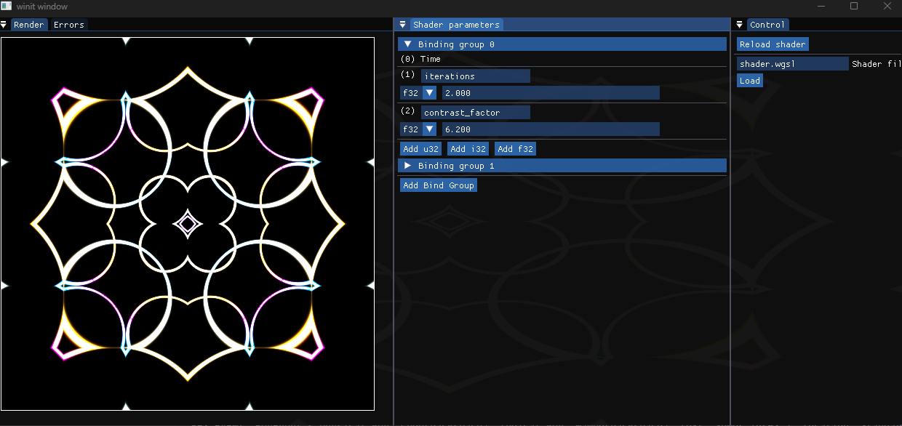

# Te Shader Play

Live-reload wgsl shaders and watch them render in real time.




## Shader parameters
You can enter custom parameters in the `Shader parameters` window.

To use the parameters in the shaders you have to declare them like:

```wgsl
@group(1) @binding(3)
var<uniform> my_shader_parameter: u32;
```

Supported parameter types are:
* u32
* i32
* f32

A time parameter is located at `@group(0) binding(0)`, which is a u32. It represents the milliseconds elapsed since the program started.

Check [the default shader](shaders/shader.wgsl) (credit: [kishimisu](https://www.youtube.com/watch?v=f4s1h2YETNY)) for an example.
